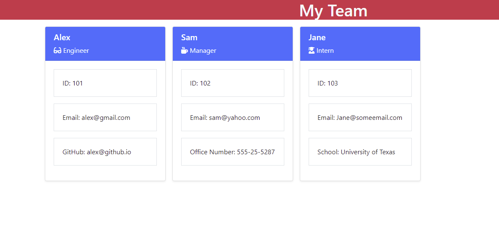

# Team Profile Generator
  

  ## Description
  Team Profile Generator App
  
  ## Link to the walkthrough video: https://youtu.be/-PujaW4l3QI

## Table of contents
* [Installation](#installation)
* [Usage](#usage)
* [Credits](#credits)
* [License](#licence)
  

  ## Installation
  
  To install all the files for the "Team Profile Generator" app please clone this https://github.com/anaumov1/team-profile-generator-an.git repository to your computer. For instructions on how to clone a repository from GitHub follow this link: https://docs.github.com/en/github/creating-cloning-and-archiving-repositories/cloning-a-repository.
This is a NODE.js based program - the user will need to install Node.js to the local terminal. Please refer to the Node.js website for instalation directions.
The user will need to install "inquirer" npm for programm to run. Please refer to the 'inquirer" npm documentation for install directions.
The user will need to install "Jest" to be able to run the test functions if so needed.
  
  ## Usage
  Run node index command in the command line. If installed correctly the user will be prompted with a series of questions. After answering all of the question the new index.html file will be created in "dist" directory.
  Use this app for quick display of the working team. User gets to choose from 3 titles at this time "Engineer", "Manager" and "Intern". After providing the relevant information the new file will be generated, open index.html in a browser to to view the new team.
  
  

  ## License
  This project is s licensed under the [MIT](LICENSE)
    
  ## Contributing
  I apreciate the help and contributions, please cdontact repository owner before contributing. Lets make this app better.

  ## Tests
 
  The tests can run by using "npm run test" command in the command line. User must install Jest in ordr to use the test functionality.

